```{css, echo=FALSE}
  body {
   <!-- background-image: url("imgs/Untitled.jpeg"); -->
  }
.section.level3 {
  background-color: #f3f3f3;
  border: 1px solid #ebebeb;
  color: #868686;
  font-size: 16px;
  height: 500px;
  margin-bottom: 10px;
  margin-right: 10px;
  max-height: 500px;
  text-align: center;
}
```

<div>

<div style="width: 50%; float: left"> 

### Ajuda para a aposentadoria dos noivos
```{r casal_relaxando, echo=FALSE, out.width = '80%', fig.align='left', class.source='myClass'}

```

#### R$ 3.108,49 

#### Faça um pix para os noivos:
#### Maurício Feijó Montenegro Júnior 
#### Pix celular 61983292815
#### Banco do Brasil


### Ajuda para mobiliar a casa 
```{r casa_mobiliada, echo=FALSE, out.width = '80%', fig.align='left'}
knitr::include_graphics("imgs/casa_mobiliada.jpg")
```

#### R$ 1.036,16


### Ajuda para os noivos comprarem dólares pra viagem
```{r dolar, echo=FALSE, out.width = '80%', fig.align='left'}
knitr::include_graphics("imgs/dolar.png")
```

#### R$ 466,27

### Aparelho de Jantar
```{r aparelho-de-jantar-42-pecas, echo=FALSE, out.width = '80%', fig.align='left'}
knitr::include_graphics("imgs/aparelho-de-jantar-42-pecas.jpg")
```

#### R$373,02  

### Aspirador de Pó Ciclônico 2 em 1 Vertical 1200W
```{r Aspirador_de_Po_Ciclonico, echo=FALSE, out.width = '80%', fig.align='left'}
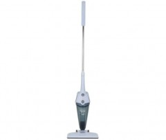
```

#### R$ 248,68

### Aspirador Robo Keep Clean 
```{r Aspirador_Robo_Keep_Clean, echo=FALSE, out.width = '80%', fig.align='left'}
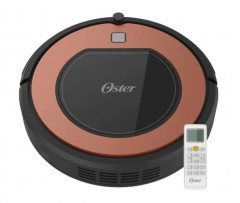
```

#### R$1.502,43

### Assadeira Retangular Alumínio Ecolon 43 cm x 21 cm 
```{r Assadeira_Retangular_Aluminio_Ecolon, echo=FALSE, out.width = '80%', fig.align='left'}
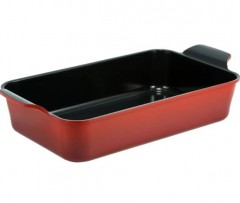
```

#### R$ 268,37


### Conjunto de panelas 
```{r conjunto-de-panela-ferro-fundido-2-pecas, echo=FALSE, out.width = '80%', fig.align='center'}
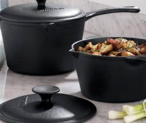
```

#### R$ 259,04

### Conjunto para sala de jantar 
```{r conjunto-para-sala-de-jantar-com-mesa-e-4-lugares, echo=FALSE, out.width = '80%', fig.align='right'}
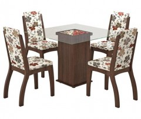
```

#### R$ 725,31

### Cooktop elétrico 
```{r cooktop-eletrico-4-bocas, echo=FALSE, out.width = '80%', fig.align='left'}
knitr::include_graphics("imgs/cooktop-eletrico-4-bocas.jpg")
```

#### R$ 2.694,02

### Coral pra cantar "Aleluia" na entrada do noivo 
```{r coral_de_casamento, echo=FALSE, out.width = '80%', fig.align='left'}

```

#### R$ 569,89 

</div>

<div style="width: 50%; float: left"> 

### Batedeira Planetária Bowl 750W
```{r Batedeira_Planetaria_Bowl_750W, echo=FALSE, out.width = '80%', fig.align='left'}
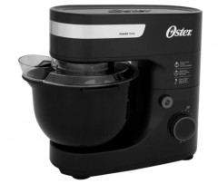
```

#### R$ 512,90


### Capacete contra rolo de macarrão para o noivo
```{r capacete, echo=FALSE, out.width = '80%', fig.align='left'}

```

#### R$ 165,79

### Cesto de Roupa Trama com Tampa e Rodízios
```{r Cesto_de_Roupa_Trama_com_Tampa, echo=FALSE, out.width = '80%', fig.align='left'}
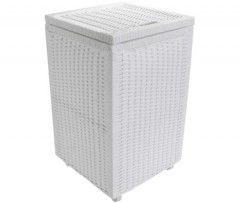
```

#### R$ 326,39

### Chaleira Elétrica Gourmand Gris 1,8L
```{r Chaleira_Eletrica_Gourmand_Gris, echo=FALSE, out.width = '80%', fig.align='left'}
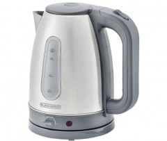
```

#### R$ 466,27

### Conjunto de bowl 
```{r conjunto-de-bowl-em-ceramica-4-pecas, echo=FALSE, out.width = '80%', fig.align='left'}
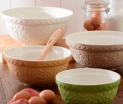
```


#### R$ 356,44

### Conjunto de controle remotos para não ter briga 
```{r controles_remotos, echo=FALSE, out.width = '80%', fig.align='left'}
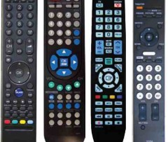
```

#### R$ 155,42

### Conjunto de descascador de alimentos 
```{r conjunto-de-descascador-de-alimentos, echo=FALSE, out.width = '80%', fig.align='left'}
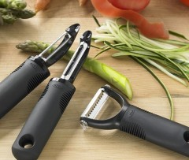
```

#### R$ 82,79


### Cortador de pizza 
```{r cortador-de-pizza, echo=FALSE, out.width = '80%', fig.align='left'}
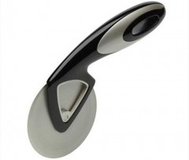
```

#### R$ 32,12 


### Cota "amigos para sempre" 
```{r amigos_velhinhos, echo=FALSE, out.width = '80%', fig.align='left'}

```

#### R$ 2.590,41

### edredon
```{r edredon, echo=FALSE, out.width = '80%', fig.align='left'}

```

#### R$ 2.590,41

</div>

<div style="width: 50%; float: left"> 


</div>

</div>